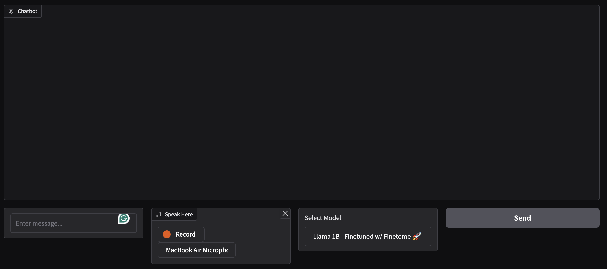

# llama-finetuning-lab-2

## Links

- [Inference UI](https://colab.research.google.com/drive/1CRTV5uNRT-Rk7rsGqL3GEIhFwbuy7lml#scrollTo=jNBFguh2yIoQ)
- [FineTome Finetuning](https://colab.research.google.com/drive/1JQtX5wP8P3R2MpMs4bpaqfX2TGivr2Ya#scrollTo=QmUBVEnvCDJv)
- [Emoji Finetuning](https://colab.research.google.com/drive/1WNthcDGTddGWGUju0cBKd2Qh_HXwL8XD#scrollTo=upcOlWe7A1vc)

## List of Models:

- Llama 1B - Finetuned w/ Finetome
- Llama + Emojis
- Vanilla Llama 3.1 3B (1000 steps of FineTome)

## Introduction

In the following repository we are going to fine-tune a pre-trained model using the Hugging Face library. The model we are going to use is the `llama-3.1`.

## Task 1

What we did first was to Finetune the `llama-3.1 1B` model using the FineTome dataset. We used the LoRA algorithm and 4bit quantization to fine-tune the model and also we created an Inference UI to test the model using Gradio:

We can see that we can input a text and a recording using Whisper. The model will then generate a response based on the input text and audio file. There is also a Dropdown list where the user can select the model to use based on all the models that were fine-tuned.

To test the model and access the Inference UI, please click [here](https://colab.research.google.com/drive/1CRTV5uNRT-Rk7rsGqL3GEIhFwbuy7lml#scrollTo=jNBFguh2yIoQ), if you have a GPU you can run the code and test the model using the `inference_ui` file.

The vanilla `llama-3.1 3B` model was trained for 1000 steps using the FineTome dataset. Just to compare it with the fine-tuned model.

## Task 2

### Data-Centric Fine-Tuning: Identifying Emojis 😁

Although, the model was able to process and identify when the text was an emoji, it could not identify the emoji it self:

We can see 4 mistakes:

1. The US flag was not adopted in 1932, it was adopted in 1777.
2. This birthday cake does not have a birthday message.
3. The panda emoji is not a red panda.
4. The hand gesture emoji says that the fingers are extended but at the same time they are curled.

Therefore, we decided to fine-tune the model using the Emoji Dataset. The dataset contains 5,000 examples of text and their corresponding emojis. The model was trained for 1 epoch and the results are shown below:

We can see that the descriptions are more accurate and the model is able to identify the emojis correctly.

Here the first message was sent to the new model and the second one to the old one, we can see that the new model was able to identify the raining emoji correctly, while the old model says that there is a person standing in the rain.

However, the model is not perfect and there are still some mistakes:

Clearly Sweden is not the same country as Suriname, we tried to use the same emoji many times and the model was not able to identify it correctly. We think that if would have trained the model for more epochs, the model would have been able to identify the last emoji correctly.

### Model-Centric Fine-Tuning (Written)

Hyperparameters are the parameters that are set before the learning process begins. They are used to control the learning process and the model's behavior. 

In order to improve to model's performance in terms of accuracy we have to trade-off between the model's performance and the time and resources used to train the model.

Some examples on how to improve the model's performance are:

- Increase the number of epochs to train the model, this would train the model for more steps and the model would be able to learn more from the dataset.

- We could increase the quantization to improve the float precision, this would allow the model to have a better understanding of the data.

- We could also increase the batch size, this would allow the model to process more data at the same time.

– We can also change the weight decay, a regularization technique that reduces the model's overfitting, if we increase the weight decay, it is less likely that the model will overfit the data, but it is also possible that the model will not learn the data correctly.

- Finally, we could increase the gradient accumulation, this allows the model to have more stable gradients and 

In the last task, we fine-tuned the `llama-3.1 1B` model using the FineTome dataset. The model was fine-tuned using the LoRA algorithm and 4bit quantization. The hyperparameters that were changed are:

1. `r`: Changed from 16 to 8, it is the number of bits used to represent the model's weights.
2. `lora_alpha`: Maintained at 16, it is the alpha value used in the LoRA algorithm.
3. `packing`: Changed from False to True, it is a boolean value that determines whether to use the packing algorithm to combine the input and output embeddings.
4. `warmup_steps`: Changed from 5 to 1250, it is the number of steps used to warm up the model before training ($0.1 \cdot \text{total steps}$).

For example the model of Task 1 was going to take 23 hours to train based on the estimated time, using the Hyperparameters described above, we were able to train the model in 11 hours and 3 Google accounts.

- `llama-3.1 1B` FineTome: ~23 hours
- `llama-3.1 1B` FineTome + Hyperparameters: ~11 hours
