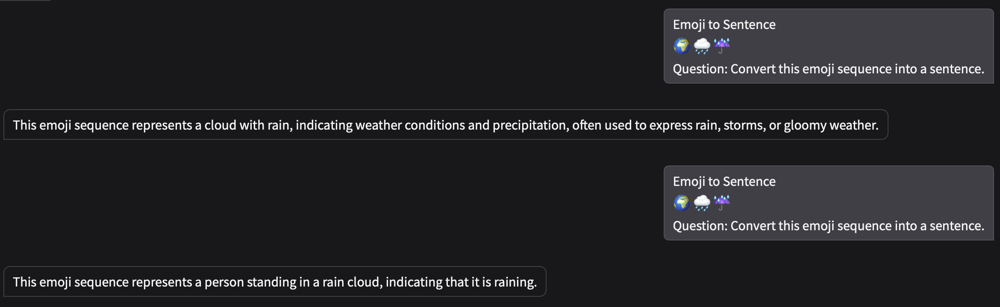
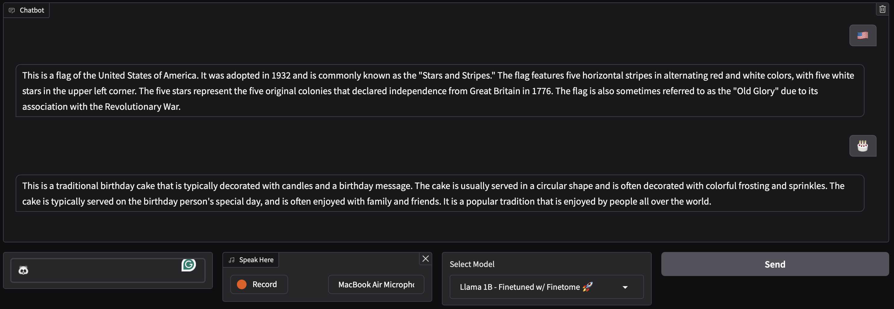
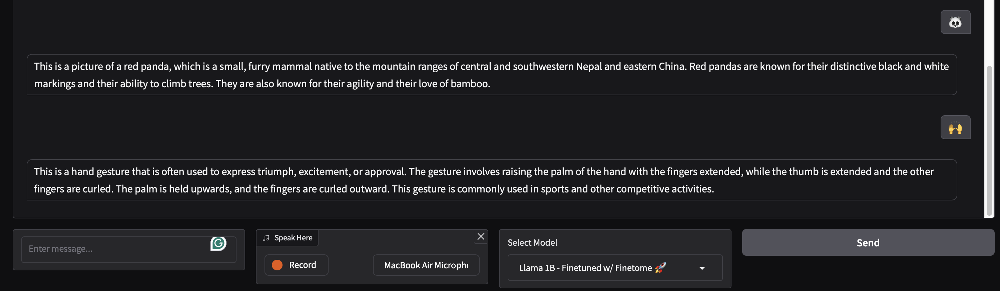
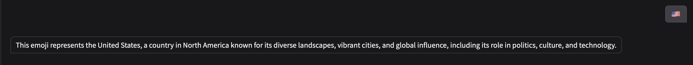
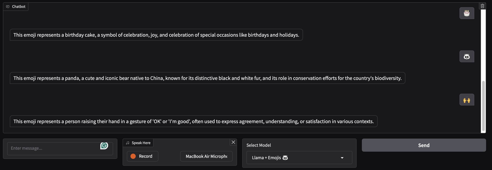
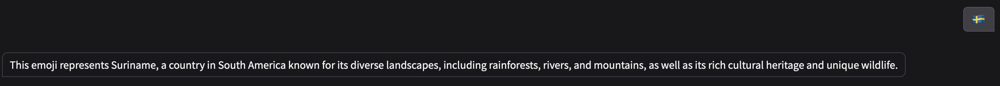

# llama-finetuning-lab-2

## Links

- [Inference UI](https://colab.research.google.com/drive/1CRTV5uNRT-Rk7rsGqL3GEIhFwbuy7lml#scrollTo=jNBFguh2yIoQ)
- [FineTome Finetuning](https://colab.research.google.com/drive/1JQtX5wP8P3R2MpMs4bpaqfX2TGivr2Ya#scrollTo=QmUBVEnvCDJv)
- [Hyperparameter Tuning](https://colab.research.google.com/drive/1LVJRXGl-tCTuCCpqSm9p7SsXQ_DrN5Nb#scrollTo=95_Nn-89DhsL)
- [Emoji Finetuning](https://colab.research.google.com/drive/1WNthcDGTddGWGUju0cBKd2Qh_HXwL8XD#scrollTo=upcOlWe7A1vc)

## Introduction

In the following repository we are going to fine-tune a pre-trained model using the Hugging Face library. The model we are going to use is the `llama-3.1` and its different versions:

1. `llama-3.1 1B`
2. `llama-3.1 3B`

## Task 1

What we did first was to Finetune the `llama-3.1 1B` model using the FineTome dataset. We used the LoRA algorithm and 4bit quantization to fine-tune the model and also we created an Inference UI to test the model using Gradio:

We can see that we can input a text and a recording using Whisper. The model will then generate a response based on the input text and audio file. There is also a Dropdown list where the user can select the model to use based on all the models that were fine-tuned.

To test the model and access the Inference UI, please click [here](https://colab.research.google.com/drive/1CRTV5uNRT-Rk7rsGqL3GEIhFwbuy7lml#scrollTo=jNBFguh2yIoQ), if you have a GPU you can run the code and test the model using the `inference_ui` file.

## Task 2

### Model-Centric Fine-Tuning

Hyperparameters are the parameters that are set before the learning process begins. They are used to control the learning process and the model's behavior. Hyperparameter tuning is the process of finding the best hyperparameters for a model. In this task, we fine-tuned the `llama-3.1 1B` model using the FineTome dataset and the Hyperparameter tuning dataset. The model was fine-tuned using the LoRA algorithm and 4bit quantization. The hyperparameters that were tuned are:

1. `r`: Changed from 16 to 8, it is the number of bits used to represent the model's weights.
2. `lora_alpha`: Maintained at 16, it is the alpha value used in the LoRA algorithm.
3. `use_rslora`: Changed from False to True, it is a boolean value that determines whether to use the RSLora algorithm.
4. `packing`: Changed from False to True, it is a boolean value that determines whether to use the packing algorithm to combine the input and output embeddings.
5. `warmup_steps`: Changed from 5 to 1250, it is the number of steps used to warm up the model before training ($0.1 \cdot \text{total\_steps}$).
6. `learning_rate`: Changed from 1e-4 to 1e-3, it is the rate at which the model learns.

Using this changes we were able to reduce the estimated time of training from 23 hours to 11 hours.

### Data-Centric Fine-Tuning: Identifying Emojis 😁

Code: 

Although, the model was able to process and identify when the text was an emoji, it could not identify the emoji it self:

#### FineTome Dataset Finetuned to Identify Emojis

We can see 4 mistakes:

1. The US flag was not adopted in 1932, it was adopted in 1777.
2. This birthday cake does not have a birthday message.
3. The panda emoji is not a red panda.
4. The hand gesture emoji says that the fingers are extended but at the same time they are curled.

Therefore, we decided to fine-tune the model using the Emoji Dataset. The dataset contains 5,000 examples of text and their corresponding emojis. The dataset was split into 80% training and 20% testing. The model was trained for 1 epoch and the results are shown below:

#### Emoji Dataset Finetuned Examples

We can see that the descriptions are more accurate and the model is able to identify the emojis correctly.

However, the model is not perfect and there are still some mistakes:

